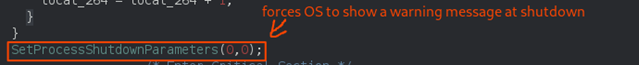
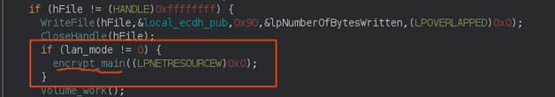

## Table of Content
- [Introduction](#introduction)
    - [Ransomware Note](#ransomware-note)
  - [Sample:](#sample)
  - [Virus Total Report:](#virus-total-report)
- [Reversing](#reversing)
  - [Argument parsing:](#argument-parsing)
  - [Preventing Shutdown](#preventing-shutdown)
  - [Terminating Services:](#terminating-services)
  - [Terminating Processes:](#terminating-processes)
  - [Deleting Shadow Volume:](#deleting-shadow-volume)
  - [Encryption](#encryption)
  - [Key Generation](#key-generation)
  - [Directory Traveresing](#directory-traveresing)
  - [Killing File Ownership](#killing-file-ownership)
  - [File Encryption](#file-encryption)
  - [Conclusion](#conclusion)
  - [Yara Rule](#yara-rule)
  - [Basic Cyber Hygiene to Avoid Ransomware](#basic-cyber-hygiene-to-avoid-ransomware)
  - [References](#references)


# Introduction

**Babuk ransomware** was first seen in early 2021 which attacked at least five big enterprises including Washington D.C Police Department, with one enterprise paying criminal eighty-five thousand dollars. Babuk is not protected or obfuscated and does not use any packers. 

Babuk uses some techniques similar to **Conti** and **REvil** ransomware. It uses **SHA256** hashing, **ChaCha8** encryption, **Elliptic-curve Diffie Helmen** (ECDH) key generation and exchange algorithm to protect the key from the victim. It can also be spread via the network.  

### Ransomware Note

||
|:--:| 
|*Ransomware Note*|

## Sample:

For reversing downloaded the sample from the [Malware-bazar](https://bazaar.abuse.ch/download/8203c2f00ecd3ae960cb3247a7d7bfb35e55c38939607c85dbdb5c92f0495fa9%22%20/h%20%20HYPERLINK%20%22https://bazaar.abuse.ch/download/8203c2f00ecd3ae960cb3247a7d7bfb35e55c38939607c85dbdb5c92f0495fa9)

Signature: 

*sha256: 8203c2f00ecd3ae960cb3247a7d7bfb35e55c38939607c85dbdb5c92f0495fa9*
*md5: e10713a4a5f635767dcd54d609bed977*

## Virus Total Report:
||
|:--:| 
|*Virus Total result* |

||
|:--:| 
|*Virus Total result*|

# Reversing
 
For our attempt to reverse engineer the malware, [Ghidra](https://ghidra-sre.org/) and [radara2](https://rada.re/n/radare2.html) were used. The reversed repository can be found in Stupa’s GitHub repository.  

||
| :--: |
|*Babuk info extraction* |

The malware is a 32-bit portable executable (PE) file which is not obfuscated at all.  
From the entropy level we can examine that the file is not compressed/obfuscated. As the maximum entropy reaches only 0.77 at offset 25510 

||
| :--:|
|*Entropy Graph*|


*Entropy: Informational density or randomness of content of a file. Compresses and encrypted files have higher entropy.*

## Argument parsing: 

To begin with, **entry** function was investigated 

||
| :--:|
| *Entry Function*|

The malware checks for the arguments provided via command line using the function **GetCommandLineA**. 

||
| :--: |
|*Argument Parsing*|


If the command line parameter is *null*, then malware encrypts locally and then network. 


|Command Argument |Functionality|
|:---------------- |:-------------|
|-lanfirst  |Encrypts locally (value == 1),and if parameter == NULL|
|-lansecond | Encrypt locally and then network (value == 0) |
|-nolan | Only encrypt locally. (value == -1) |

The malware is quite flexible with these command-line arguments to be set as per the attacker’s intention and TTP and encrypting the mounted folder before or after the local disk. The ability to use parameters provides attackers with a simple approach to encrypt network resources. 

The malware looks for these three switches in all command-line arguments and overrides the behavior mode based on the last valid argument. The malware authors does not use a **break** instruction to terminate the argument loop, For example.**babuk.exe -lanfirst - –nolan**,,prevents the ransomware from encrypting the network as -nolan overrides the **-lanfirst** behavior mode.  

## Preventing Shutdown

||
| :--:|
|*Preventing Shutdown*|

Furthermore, the malware also appears to use  the function **SetProcessShutdownParameters** to set the shutdown level to 0. These forces  Operating System (OS) on victim’s device to pop up a warning message during the shutdown process so that users need to shut down the OS manually.  

||
| :--:|
|*Terminating Services process*|


## Terminating Services: 

Not only-but also, the malware is developed to terminate all services hardcoded in the malware before encryption. 

We observed that the ransomware calls the **Service Control Manager** using the function **OpenSCManagerA**. This enumerates the status of running services in the target system, retrieve the name and status of each dependent service and send stop control to dependent services using **ControlService(SERVICE_CONTROL_STOP)**. For this it uses the functions **OpenSCManagerA**, **OpenServiceA**, **QueryServiceStatusEX**, **EnumDependentServiceA**, **ControlService.** 

||
|:--:|
|*Enumerating and terminating Services*|

The following is the list of the services that are terminated  by this malware  


|Services |
|:----------------|
|vss, sql, svc$, memtas, mepocs, sophos, veeam, backup, GxVss, GxBlr, GxFWD, GxCVD, GxCIMgr,|
|DefWatch, ccEvtMgr, ccSetMgr, SavRoam, RTVscan, QBFCService, QBIDPService,Intuit.QuickBooks.FCS|
|QBCFMonitorService, YooBackup, YooIT, zhudongfangyu, sophos,stc_raw_agent,VSNAPVSS, VeeamNFSSvc|
|veeam, PDVFSService, BackupExecVSSProvider, BackupExecAgentAccelerator,VeeamTransportSvc, VeeamDeploymentService, |
|BackupExecAgentBrowser,BackupExecDiveciMediaService, BackupExecJobEngine,CAARCUpdateSvc|
|BackupExecManagementService, BackupExecRPCService, AcrSch2Svc, AcronisAgent,CASAD2DWebSvc.|

## Terminating Processes:

Consequently, the malware then proceeds to terminate the  system processes (if running) that are  hardcoded in the malware .  As a resultresult, it  also is designed to terminate the dependent processes (where required).

To achieve this, the malware uses functions **CreateToolhelp32Snapshot**, **Process32FirstW**, **Process32NextW**as shown in figure9. 

||
|:--:|
|*Terminating Process*|

Following is the list of the processes that are closed. 

|Processes |
|:----------------|
|sql.exe, oracle.exe, ocssd.exe, dbsnmp.exe, synctime.exe, agntsvc.exe, isqlplussvc.exe,|
|xfssvccon.exe, mydesktopservice.exe, ocautoupds.exe, encsvc.exe, firefox.exe,|
|tbirdconfig.exe, mydesktopqos.exe, ocomm.exe, dbeng50.exe, sqbcoreservice.exe, excel.exe,|
|infopath.exe, msaccess.exe, mspub.exe, onenote.exe, outlook.exe, powerpnt.exe, steam.exe, |
|thebat.exe, thunderbird.exe, visio.exe, winword.exe, wordpad.exe, notepad.exe|

## Deleting Shadow Volume:

As part of the sequence, the next action the malware undertakes is deleting the shadow volumes of the victim machine. To do so, it first checks whether  the target OS is 32-bit or 64-bit using function **IsWow64Process** in a dynamic shell. It then calls **Wow64RevertWow64FsRedirection** to disable and then enable file system redirection.  

Then it calls **ShellExecuteW** to execute the command as shown in figure10: 

*cmd.exe /c vssadmin.exe delete shadows /all /quiet* 

||
|:--:|
|*Deleting Shadow Copies*|

Babuk deleted the shadow copies before and after the encryption

## Encryption

*Jumping around the graphs just to do a simple multiplication*, this is where ECC (Elliptic curve cryptography) gets its strength. 

||
|:--:|
|*Generating ChaCha8 keys*|

||
|:--:|
|*Generating ChaCha8 keys*|

## Key Generation

At very beginning Babuk generate four random buffers using function **RtlGenRandom** as shown in figure13. Among which, two are used as ChaCha8 keys and other two as ChaCha8 nonces.

||
|:--:|
|*Generating keys and Nonce*|

Next action is to encrypt the second key using first key and first nonce and after that the first key is encrypted using encrypted second key and nonce This encrypted first key is treated as the Elliptic-curve Diffie-Hellman (ECDH) private key for the victim machine. Then it generates victim ECDH public key using the private key. Again, after that it generates a shared secret using the victim’s private key and the author’s hard-coded public key. Shared secret is then passed to sha256 hashing algorithm to generate two ChaCha8 keys to encrypt the files. The pictorial representation for encryption in shown in figure14. 

||
|:--:|
|*Encryption and Decryption Mind Map*|

 Only the author can decrypt the files as they have a private key. Babuk saves the ECDH public key in the local directory as *C:\\Users\\%username%\\Appdata\\ecdh_pub_k.bin*

After keys generation it uses function **encrypt_main** for the encryption.

||
|:--:|
|*Main Encryption*|

## Directory Traveresing

Babuk uses recursive technique to traverse directory and encrypt the files. It uses functions **WNetOpenEnumW** and **WNetEnumResourceW** as shown in figure16 to starts an enumeration of network resources (remote directory) or existing connection.  

||
|:--:|
|*Main Encryption function*|

As shown in screenshot17 ,in the function **directory_traversing**, it uses functions **FindFirstFileW** and **FindNextFileW** to search a directory for a file or subdirectory with a name that matches a specific name. It creates a *How to restore your Files.txt* to instruct the victim in paying ransom and decrypt files. 

||
|:--:|
|*Directory Trasversing*|


||
|:--:|
|*Directory Trasversing*|

||
|:--:|
|*Directory Trasversing*|


To avoid encrypting the ransomware note (How to Restore Your Files.txt) or encrypted files, it checks if the file name is How to Restore Your Files.txt or the extension is ** __NIST_K571__** using function **lstrcmpW**. 

The interesting thing about Babuk is it only decrypts 16 directory layers deep. For example, we have a directory path as *C:\Users\Stupa\Desktop\Project1\<….....>\Project13\Project14*
Babuk only encrypts up to Project13 directory leaving Project14.

## Killing File Ownership
s
Files that are being used by some processes cannot be encrypted until the process leaves the files. To achieve so, Babuk uses Windows Restart Manger to terminate the processes that are using those files (Aka kills ownerships of files). As per figure18  ,It uses the functions **RmStartSession** ,**RmRegisterResource** , **RmGetList** and **TerminateProcess** to terminate the processes. 

||
|:--:| 
|*Killing file ownership*|


## File Encryption

Another interesting thing about Babuk is that it uses function **GetFileSizeEx** to divide the whole encryption of files into two parts, less than and greater than or equals to **~41Mb (41943041 bytes)** as shown in figure19. 

||
|:--:|
|*Smaller and Larger file encryption*|

For the smaller size file, it is mapped entirely and encrypted with ChaCha8 two times. 

For the larger file size, the entire file is divided into three equal chunks and first **~10Mb (10485760 bytes)** of each chunk are encrypted two times using ChaCha8. 

## Conclusion

Although the ransomware does not use any packer or obfuscation technique and had limited coding experience, but the ransomware uses the strong encryption mechanism like **ECDH** which is the main strength of the ransomware due to which attackers can compromise various big business organizations. 


## Yara Rule

```py
rule babuk-ransomware 

{ 

    meta: 

        description = "For babuk Ransomware" 

        author = "Manoj Ghimire:Stupa" 

  	malware-family = “Ransom:Win/Babuk”  

        hash = "8203c2f00ecd3ae960cb3247a7d7bfb35e55c38939607c85dbdb5c92f0495fa9" 

    strings: 

        $string1 = "BY BABUK LOCKER" 

        $string2 = "http://babukq4e2p4wu4iq.onion" 

        $string3 = "-lanfirst" 

        $string4 = "-lansecond" 

        $string5 = "-nolan" 

        $gen_randomnumber = {55 8b ec 83 ec 08 68 c0 81 40 00 ff 15 5c 90 40 00 68 54 17 40 00 ff 15 38 90 40 00 89 45 fc 68 64 17 40 00 8b 45 fc 50 ff 15 34 90 40 00 89 45 f8 6a 58 68 d8 81 40 00 ff 55 f8 8b e5 5d c3 cc} 

        $ecdh_generate_keys = {55 8b ec 83 ec 08 68 50 18 40 00 68 08 18 40 00 8b 45 08 83 c0 48 50 8b 4d 08 51 e8 10 07 00 00 83 c4 10 8b 55 0c 52 e8 94 02 00 00 83 c4 04 3d 1d 01 00 00 7d 06 33 c0 eb 5d eb 5b 68 98 18 40 00 e8 7a 02 00 00 83 c4 04 89 45 f8 8b 45 f8 83 e8 01 89 45 fc eb 09 8b 4d fc 83 c1 01 89 4d fc 81 7d fc 40 02 00 00 7d 12 8b 55 fc 52 8b 45 0c 50 e8 ba 00 00 00 83 c4 08 eb dc 8b 4d 0c 51 8b 55 08 83 c2 48 52 8b 45 08 50 e8 f1 09 00 00 83 c4 0c b8 01 00 00 00 8b e5 5d c3 cc cc cc cc cc} 

        $public_key = {8d 85 f4 fd ff ff 50 68 88 22 40 00 ff 15 6c 90 40 00 68 98 22 40 00 8d 8d f4 fd ff ff 51 ff} 

        $restore_file = {cc 21 40 00 8d 95 d4 fd ff ff 52 ff 15 40 90 40} 

        $extension = {8d 94 4d d4 fd ff ff 52 ff} 

    condition: 

        uint16(0) == 0x5A4D and all ($string*) and $gen_randomnumber and $ecdh_generate_keys and $public_key and $restore_file and $extension 

} 
```


## Basic Cyber Hygiene to Avoid Ransomware

Despite cyber security hygiene guidelines not being unfamiliar, they are frequently disregarded by businesses, even though they have a considerable influence on many areas. The basic preventive measures are listed below:   

*    Keep your device updated – Ensure that you act on the software update prompts without delay. 

*    Beware of suspicious emails - Phishing emails are used for spreading Ransomware.  
*    Protect your devices from rogue software – Always download from the genuine source.  
*    Always backup your data – Use Cloud drives (Google Drive, One Drive, Dropbox, etc), External Hard Disk Drive etc. 
*    Ensure you protect your device with Antivirus/Anti-malware – Keep it up to date! 


## References

https://www.bleepingcomputer.com/news/security/babuk-ransomwares-full-source-code-leaked-on-hacker-forum/ </br>
https://heimdalsecurity.com/blog/the-full-source-code-for-the-babuk-ransomware-published-on-a-russian-hacker-forum/ </br>
https://github.com/Hildaboo/BabukRansomwareSourceCode </br>
https://therecord.media/ransomware-gang-leaks-data-from-us-military-contractor-the-pdi-group/ </br>
https://bazaar.abuse.ch/download/8203c2f00ecd3ae960cb3247a7d7bfb35e55c38939607c85dbdb5c92f0495fa9/ </br>
https://www.acronis.com/en-gb/articles/babuk-ransomware/ </br>
https://docs.microsoft.com/en-us/windows/win32/winprog/windows-data-types </br>
https://docs.microsoft.com/en-us/windows/win32/api/winnetwk/ </br>
https://hackage.haskell.org/package/cryptohash-sha256-0.11.102.1/docs/Crypto-Hash-SHA256.html </br>
https://docs.microsoft.com/en-us/visualstudio/extensibility/internals/list-of-available-services?view=vs-2022 </br>
